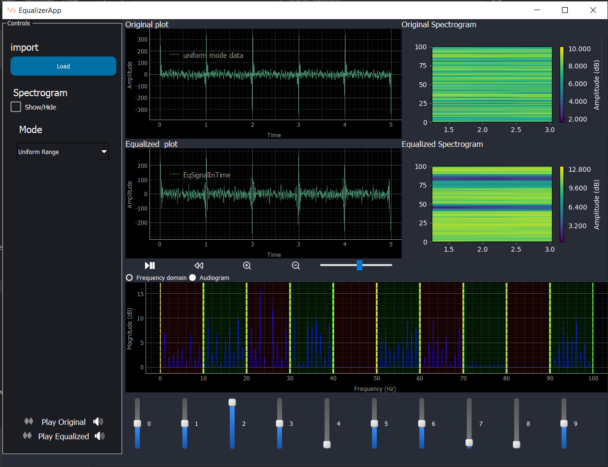
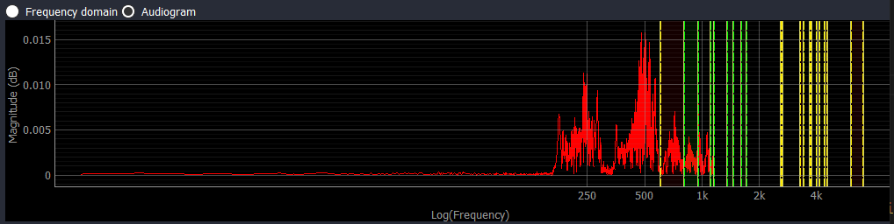

# Signal Equalizer Desktop Application

## Description
This project involves the development of a desktop application designed to process signals by allowing users to modify the magnitude of certain frequency components via sliders and then reconstruct the signal. The application is versatile, offering multiple operational modes and an intuitive user interface for signal analysis and manipulation.

## Features

### 1. **Modes of Operation**
The application supports multiple modes to cater to different use cases:

#### a. **Uniform Range Mode**
- The total frequency range of the input signal is divided uniformly into 10 equal frequency ranges.
- Each range is controlled by a corresponding slider in the UI.
- **Validation:**
  - A synthetic signal file is prepared for validation. This signal is an artificial composition of several pure single frequencies across the range.
  - Users can track and validate the effect of slider adjustments on each frequency component.

  

#### b. **Music and Animals Mode**
- The sliders control the magnitude of specific animal sounds and musical instrument sounds.
- Supports at least 3 animal sounds and 3 instrument sounds in the mixture.


#### c. **Vocal Mode**
- Enables precise control over vocals (e.g., vowels) and musical instruments in a song.


#### d. **Weiner Mode**
- Implements noise filtering to clean up the signal.


### 2. **Dynamic User Interface**
- Users can switch between modes via an option menu or combobox.
- The UI adapts to the selected mode by updating slider captions and, in some cases, the number of sliders, while maintaining consistency in the overall layout.

### 3. **Fourier Transform Graph**
- Displays the Fourier transform of the signal.
- Offers flexibility to view the frequency range on:
  - **Linear Scale**
  - **Audiogram Scale** (researched and implemented based on audiological standards).
- The user can toggle between the scales without interrupting other functionalities.




### 4. **Signal Viewers**
- **Two Linked Cine Signal Viewers**: One for the input signal and one for the output signal.
  - Features:
    - Play, stop, pause, speed control, zoom, pan, and reset functionality.
    - Synchronous display: Both viewers always show the same time segment of the signal during interactions like scrolling or zooming.

### 5. **Spectrograms**
- Includes input and output spectrograms.
- The output spectrogram dynamically reflects changes made via the equalizer sliders.
- Users can toggle the spectrograms on or off as needed.

## Installation and Usage
1. Clone the repository:
   ```bash
   git clone https://github.com/somaiaahmed/Signal-Equalizer.git
   ```
2. Navigate to the project directory and install the required dependencies:
   ```bash
   pip install -r requirements.txt
   ```

3. Run the application:
   ```bash
   python EqualizerApp.py
   ```

4. Use the UI to:
   - Load a signal.
   - Modify frequency components using sliders.
   - Switch between modes and scales as required.
   - View and analyze the signal using cine viewers and spectrograms.
## Acknowledgments
This project was developed as part of a Digital signal processing Course to provide users with an intuitive and powerful tool for signal manipulation and analysis.


