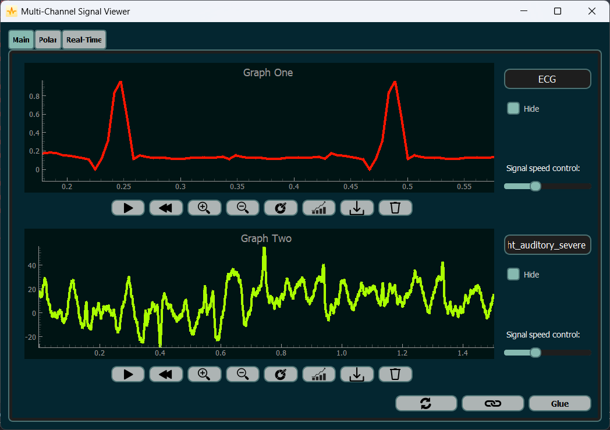
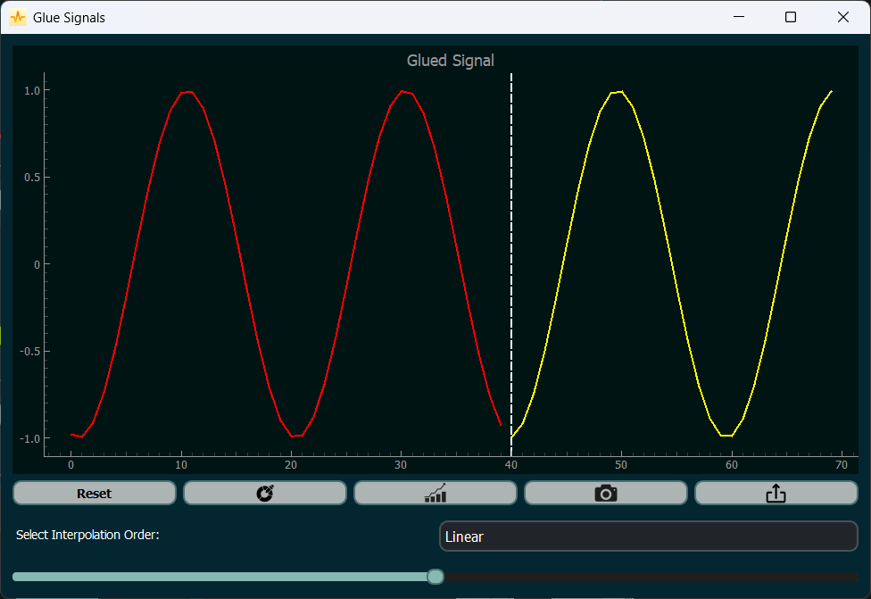

# MedSignalScope: Multi-Port ICU Signal Viewer  

## Overview  
MedSignalScope is a **real-time, multi-port medical signal viewer** built with **Python and Qt**. It enables visualization, analysis, and manipulation of **ECG, EMG, EEG, and other biomedical signals** with live streaming support, synchronized graphs, and advanced playback controls.  

## Features  
- 📡 **Multi-Port Signal Streaming** – Load signals from files or real-time sources.  
- 📊 **Dual Synchronized Graphs** – Link/unlink graphs for comparative analysis.  
- 🎥 **Cine Mode Playback** – Dynamic signal visualization with speed control.  
- 🔧 **Customizable Controls** – Zoom, pan, color change, labeling, and more.  
- 🧩 **Signal Merging (Glue Tool)** – Interpolate and combine signals seamlessly.  
- 📄 **Automated PDF Reporting** – Capture snapshots and generate reports with statistical insights.  

## Installation  
1. Clone the repository:  
   ```bash
   git clone https://github.com/yourusername/medsignal-scope.git
   cd medsignal-scope
   ```
2. Install dependencies:  
   ```bash
   pip install -r requirements.txt
   ```
3. Run the application:  
   ```bash
   python main.py
   ```

## Usage  
- Open a **signal file** or connect to a **real-time source**.  
- Visualize signals in **dual graphs** (independent or synchronized mode).  
- Manipulate signals with **playback, zoom, pan, and color settings**.  
- Use the **glue tool** to merge signals with interpolation.  
- Export signal snapshots and statistics to a **PDF report**.  

## Screenshots  
### 📌 *Main Interface*  


### 📌 *Signal Merging & Report Generation*  


## Technologies Used  
- **Python** (NumPy, SciPy, PyQt)  
- **Matplotlib** for signal plotting  
- **fPDF** for PDF generation  

## Contributors  
- [Mina Raafat](https://github.com/minaraafat21) 
- [Mina Wagdy](https://github.com/MinaWagdy5) 
- [Biatris](https://github.com/Biatris-003)

